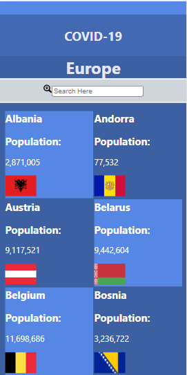
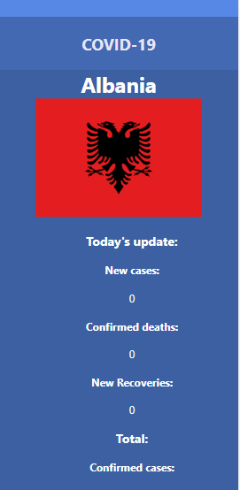

# Metrics-webApp

> This is a web application that'll display the total number of COVID-19 cases in different countried round the world. The users can click on any country for more details.

## Mockup
This design was inspired by Nelson Sakwa, in association with the Creative Commons license.

## Video Presentation

## Built With

- HTML

- CSS

- JavaScript

- React JS

- Redux

- Lighthouse (An open-source, automated tool for improving the quality of web pages. It has audits for performance, accessibility, progressive web apps, SEO and more).

- Webhint (A customizable linting tool that helps you improve your site's accessibility, speed, cross-browser compatibility, and more by checking your code for best practices and common errors).

- Stylelint (A mighty, modern linter that helps you avoid errors and enforce conventions in your styles).

- ESlint (A mighty, modern linter that helps you avoid errors and enforce conventions in JavaScript codes)

## Getting Started

To get a local copy up and running follow these simple example steps.

- copy this link https://github.com/Roseokpe/covid-stats.git
- get the directory that you want to clone the repository.
- open the command prompt in this directory.
- write git clone https://github.com/Roseokpe/covid-stats.git
- go to the repository folder in your command prompt cd Metrics-webApp
- use npm install to install the dependencies.
- use npm start to start live server.

## Prerequisites

- Have a working and updated browser
- Have a local version control like git install on your computer
- Have an account and sign in on GitHub, as online/remote version control system
- Basic knowledge in JS and React JS

### Setup

- Clone the git repo using this command: git clone https://github.com/Roseokpe/covid-stats.git

### Run tests

- npx hint . : To test html codes
- npx stylelint "/*.{css,scss}"** : To test css code
- npx eslint . : To test Eslint Report

### To test the application

- npm install --save-dev jest
- npm test

## Live Demo

- [Live link](https://62c0520991bd054aae5730d6--covid19-globally.netlify.app/)

## Author

-[GitHub](https://github.com/roseokpe)
-[Twitter](https://twitter.com/roseokpe)
-[LinkedIn](https://linkedin.com/in/roseokpe )

## Contributing

Contributions, issues, and feature requests are welcome!

Feel free to check the issues page.

## Show your support

Give a star if you like this project!

## Acknowledgments

- Microverse linters
- Coding partners
- Nelson Sakwa 

## 📝 License

This project is [MIT](./LICENSE) licensed.